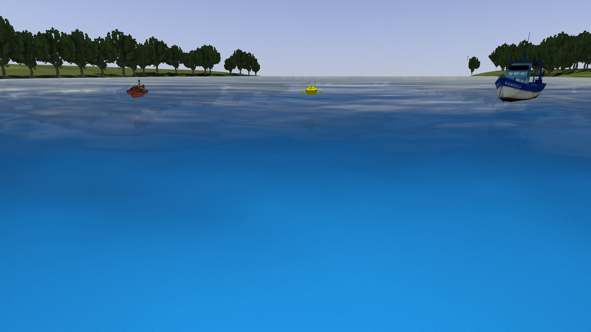
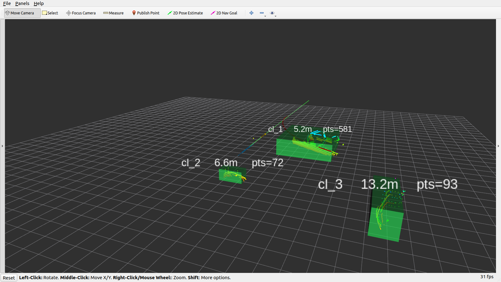
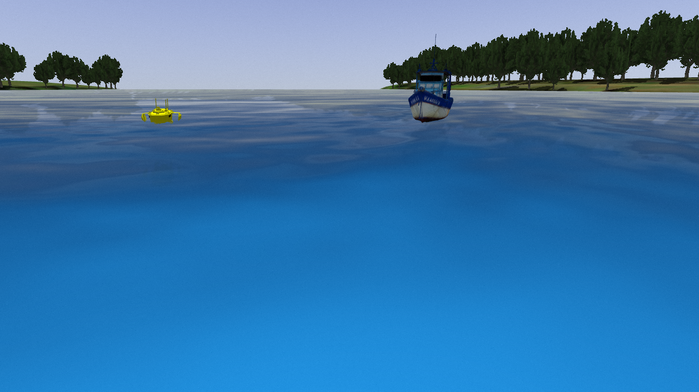

# SeaDrive-MLM

SeaDrive-MLM is a ROS/Gazebo workspace for USV COLREG encounter simulation and Monte Carlo evaluation. The public entrypoint is `boat_monte_carlo.bash`, with two maintained modes:

- `Geo`: geometry and local-planner baseline.
- `Local`: local OpenAI-compatible VLM/LLM service for COLREG decisions.

## Demo

Gazebo encounter simulation:



RViz monitoring view:



Monte Carlo trajectory playback:


VLM-based COLREG decision example:



## VLM Call Example

The `Local` mode talks to an OpenAI-compatible local VLM/LLM endpoint. In the demo shown here, the model `qwen3-vl-2b-instruct-local` is served with the vLLM model loading and inference framework.

Example request context:

```text
===== LLM INPUT call_id=3 =====
wall_time: 2026-06-16 19:55:42
model: qwen3-vl-2b-instruct-local
prompt:
You are the decision module controlling the own unmanned surface vessel.
Scene input: 4 recent clean camera image frames as a short video, ordered oldest to newest, sampled about 2.5 seconds apart.
Encounter summary: current target vessel count is 3. In reasoning, explicitly state this count and name the greatest-threat target_id from the Track input or Active target ids.
COLREGS: follow standard maritime encounter rules using the camera video trend.
Return only JSON: {"confidence":number,"reasoning":string,"course_action":"KEEP_COURSE|TURN_STARBOARD|TURN_PORT","speed_action":"SLOW_DOWN|SPEED_UP|EMERGENCY_STOP"}.
===== END LLM INPUT call_id=3 =====
```

Example response:

```json
{"confidence":0.8,"reasoning":"3 targets visible; yellow vessel on right is closest and moving toward own vessel, increasing distance risk. Own vessel maintains course.","course_action":"KEEP_COURSE","speed_action":"SLOW_DOWN"}
```

## Requirements

- Ubuntu 20.04 with ROS Noetic.
- Gazebo and `gazebo_ros`.
- `catkin_tools`.
- Python 3 packages used by the runtime nodes, including `numpy`, `Pillow`, `opencv-python`, and ROS Python packages.
- For `Local` mode, a local OpenAI-compatible chat/completions endpoint that can accept the configured VLM model.


## Build

From the repository root:

```bash
catkin build -j2
source devel/setup.bash
```

## Run Monte Carlo

Show usage:

```bash
bash boat_monte_carlo.bash --help
```

Run one geometric baseline trial:

```bash
MC_GUI=false bash boat_monte_carlo.bash HeadOn Geo 1
```

Run one local VLM/LLM trial:

```bash
MC_GUI=false LOCAL_API_BASE=http://host:8000/v1 MODEL=qwen3-vl-2b-instruct-local \
  bash boat_monte_carlo.bash NarrowMulti Local 1
```

Supported scenarios are `HeadOn`, `Crossing`, `Overtaking`, `MultiShip`, and `NarrowMulti`.

## Common Environment Variables

- `MC_COUNT`: number of trials when the count argument is omitted.
- `MC_TIMEOUT_S`: timeout per trial in seconds.
- `MC_RESULT_DIR`: output directory override.
- `MC_GUI`: set `false` for headless Gazebo runs.
- `MC_SEED`: fixed base seed; trial N uses `MC_SEED + N - 1`.
- `MC_PLOT_TRAJECTORIES`: set `false` to skip trajectory plots.
- `LOCAL_API_BASE` or `API_BASE`: OpenAI-compatible local API base URL for `Local` mode.
- `MODEL` or `LOCAL_MODEL`: local model name for `Local` mode.

## Outputs

By default each run writes to:

```text
tmp/monte_carlo/<timestamp>_<scenario>_<mode>/
```

Important files include `results.csv`, `summary.txt`, per-trial trajectory CSVs, optional VLA event logs, and optional trajectory plots.
